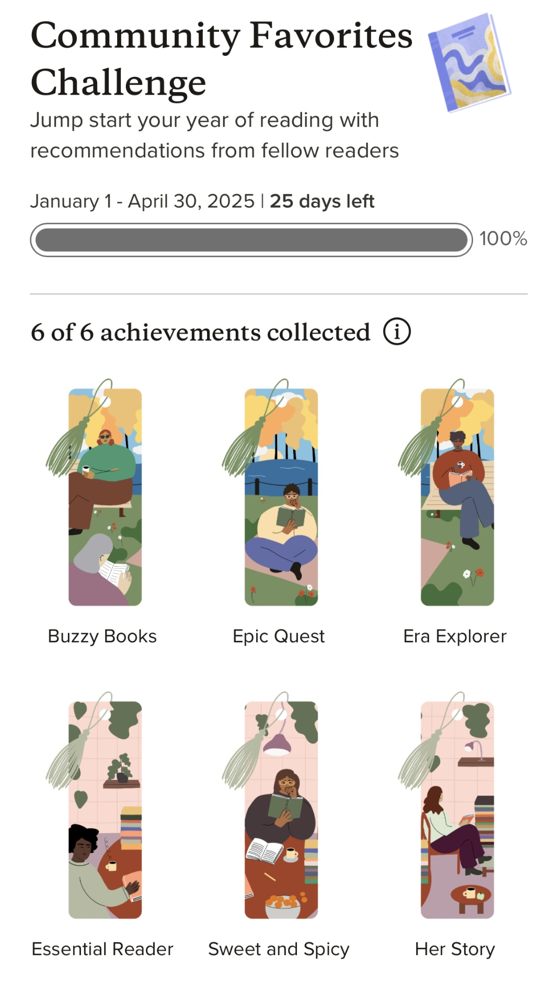

…or basically ruining my reading experience for no reason at all. Because my brain can't resist a good meaningless achievement (I'm the kind of person who has driven myself to insanity in the pursuit of playstation trophies), I decided to take part in Goodreads new community favorites challenge. I finished the challenge of reading 6 books from qualifying categories with 25 days left. But the whole thing really degraded my reading experience and once I started I couldn't be compelled to stop under any circumstances (thank you, brain!).

I didn't read any <i>bad</i> books, but it felt like a never ending slog of books that just didn't resonate with me. Lately, I've just had a knack for choosing things I won't like and my concentration hasn't been great. On top of that, I once read an interview with an author who said she read a bad Goodreads review and it sent her into an obsessive spiral. The knowledge that my candid review could potentially ruin the mental health of a random author really freaked me out. It's resulted in rarely giving a book less than 3 stars, even when I want to. All of this combined has made 2025 kind of 💩 for one of my favorite pastimes. 
I don't typically make new years resolutions, but this year I made a promise to myself to be more deliberate in my reading. I probably won't participate in the challenges in the future (I tell myself as I shrivel up into a corncob).